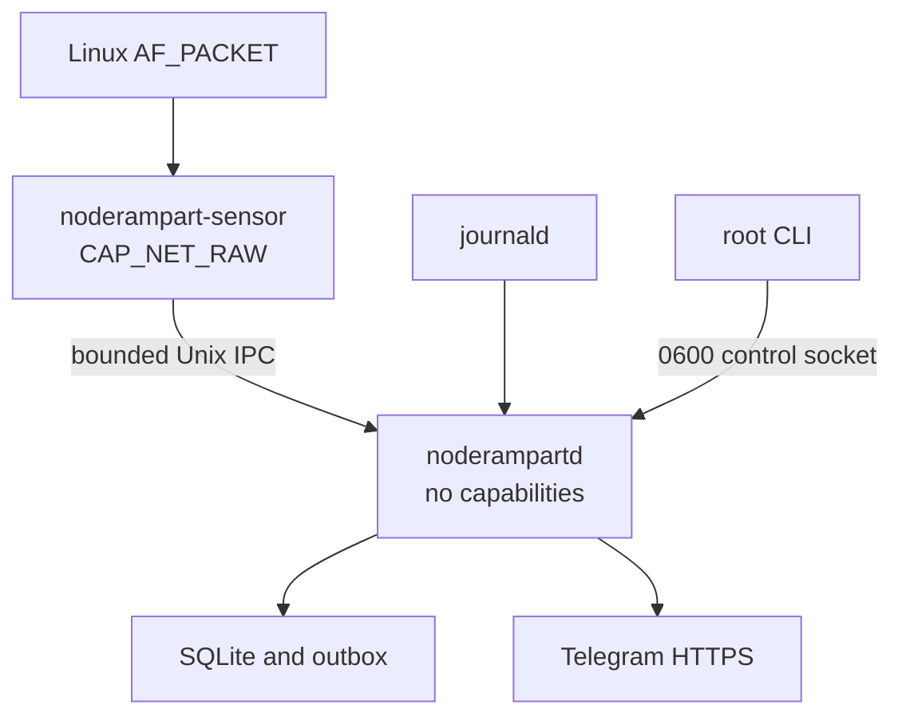

# Architecture

## Trust boundaries

`noderampart-sensor` is the only process with a Linux capability. It opens an AF_PACKET socket, parses only Ethernet/IP/TCP/UDP/ICMP headers, aggregates flow metadata for a configured interval, and sends the aggregate to the daemon. Its detail map is capped by `sensor.max_tracked_flows`; new keys beyond the cap contribute to overflow counters while fixed global inbound SYN/UDP/ICMP and RX/TX counters continue.

`noderampartd` has no Linux capabilities. It validates every sensor frame, enriches remote addresses using local read-only MMDB files, runs detector state machines, writes SQLite, reads OpenSSH messages through a fixed `journalctl` executable, and delivers the persistent notification outbox.

The CLI does not talk to the Internet. It uses a mode-`0600` Unix control socket. The daemon verifies `SO_PEERCRED` and accepts only root or its own UID.

## IPC protocol

- Four-byte big-endian length followed by strict JSON.
- Maximum frame size: 1 MiB.
- Maximum flow records per batch: 4,096 by protocol; configuration may select a smaller cap.
- Sensors send version 3, including remote ports for UDP request/reply matching.
  New daemons accept versions 1/2/3; older protocols have incomplete UDP scan
  coverage. Upgrade the daemon before the sensor, or stop and replace both.
- Unknown/trailing fields, invalid directions/protocols/IPs, zero or implausible counters, unsafe timestamps, and unsafe interval values are rejected.
- Sensor peers must have the configured sensor service UID, in addition to Unix group permissions. CLI and sensor verify the daemon service UID; control has a 16-connection cap.

JSON is used for the alpha to make captures and compatibility failures inspectable. A bounded binary protocol may replace it after the VM test matrix establishes stable fields.

## Collection and reconciliation

The daemon reads `/proc/net/dev` once per second for authoritative guest-interface totals. The sensor provides per-remote-IP attribution and reads `PACKET_STATISTICS` each batch for kernel packet/drop counts. Reports show these values, statistics-read errors, and the unattributed difference. This is intentionally visible because AF_PACKET loss, cardinality overflow, GRO/GSO/TSO, VPNs, containers, tunnels, and provider metering can make the totals disagree.

Capture parse errors use an atomic counter. If connecting or writing to the
daemon fails, the sensor retains bounded health counters and an estimate of
undelivered batches, packets, and bytes for its next successful write. A 250 ms
write deadline prevents an unresponsive peer from blocking the sender
indefinitely. Failed flow summaries are discarded instead of being counted in
a later detection-rate window. A saturation flag identifies health totals that
are lower bounds.

A successful socket write is not an acknowledgment of daemon persistence, so
IPC loss is an estimate. Pending health is held only in sensor memory, and
recovered counters are recorded in the recovery batch's hourly bucket. Sensor
restart and failures after a successful write remain coverage limitations.

When explicit interface settings are empty, bounded rtnetlink discovery selects
the best main-table IPv4 and IPv6 defaults and deduplicates links. Explicit lists
support eight names; automatic mode budgets two. Flow/buffer/detector limits are
partitioned. Incident and UDP continuity are isolated per interface. Aggregates
sum selected interfaces without claiming packet deduplication across tunnels.

The interface-total collector retries initial route discovery and failed reads
once per second, keeping coverage degraded until it can emit a valid delta.
Selection and interface identity are reconciled each second. Read failures and counter
resets establish a new baseline, so traffic during an observation gap is
omitted instead of being assigned to the recovery interval. Coverage transitions
are retried if their status cannot be stored. Schema 3 retains bounded coverage
intervals, explicit journal gaps and conservative unknown intervals across
process restarts; unrecorded time is not assumed healthy.

## Storage

The configured daemon uses a single exclusive SQLite connection, DELETE rollback journaling, FULL synchronization, disabled cache spills, and a database page ceiling. The ceiling reserves space for the corresponding rollback journal within the active-file budget. See [Storage budget](STORAGE-BUDGET.md) for the exact bound and tradeoffs. Foreign keys, `trusted_schema=OFF`, `secure_delete=FAST`, and a five-second busy timeout remain enabled. The schema contains:

- immutable security events;
- hourly aggregated authentication observations capped at 65,536 keys per hour;
- hourly attributed traffic capped at 16,384 keys per hour;
- hourly authoritative interface totals;
- hourly collector health and loss indicators;
- current component states, bounded coverage intervals/gaps and journal checkpoints;
- persistent notification outbox capped at 10,000 pending messages and 32 MiB of pending bodies;
- idempotent report runs and immutable rendered daily snapshots;
- schema migrations.

The database and parent directory reject relevant symlinks. The database is forced to mode `0600`. Events are retained for seven days and hourly aggregates for thirteen months in the alpha.

Schema 2 adds IPC loss and saturation counters; schema 3 adds recovery, report
history and queue operations. Schema 4 adds event delivery decisions, silences,
coalescing/claim metadata, timeline indexes and per-interface totals.
Transactional upgrades preserve supported historical data and
reject unknown future schemas. Authentication aggregates, generated events,
outbox records and acknowledged journal cursors commit together. A full queue
increments a rejection counter without dropping the stored security event.
Rendered reports are retained for thirteen months and generated with Telegram
both enabled and disabled. Backups use validated VACUUM INTO snapshots.

Incident updates merge only before attempts/claims in a fixed window. The worker
claims and reloads the final body atomically. Silences suppress event admissions
and pending alerts, retain history, and never release a backlog on expiry.
Historical health fills unknown time and separates component, loss and storage
evidence. Backfill uses bounded civil dates and immutable local archives. Offline
JSONL replay uses production detectors with file-local pseudonyms and strict
limits; it never connects to the active daemon or database. Shared contracts and
bounds are detailed in [v0.3 operations](V0.3_OPERATIONS.md).

## Failure behavior

- Sensor absent: daemon continues with SSH monitoring and interface totals; reports state that detailed sensor coverage is unavailable.
- MMDB absent: collection continues with unknown attribution.
- Telegram unavailable: messages remain in the bounded SQLite outbox and retry with exponential backoff and jitter; capacity exhaustion is logged and rejects new queue entries.
- Journal exit restarts with bounded backoff, cursor verification and time/count-limited replay. Collector/storage failures remain visible in independent in-memory health and bounded historical coverage. Control or sensor socket-server exit terminates the daemon for systemd restart.
- Telegram permanent failures are quarantined; ten unsuccessful attempts stop automatic retry. Server waits persist per destination and stop the remainder of a fetched batch. Unsent bodies expire after seven days; sent history remains for thirty days.
- Cardinality cap reached: total counters continue, detail is dropped, and overflow is reported.
- Malformed packet or IPC input: bounded rejection; the process does not execute input as code or shell.

## No active response

The alpha never invokes nftables, iptables, firewalld, Fail2Ban, CrowdSec, or cloud-provider APIs. Detection thresholds can therefore be tuned without a false positive locking the operator out of the VPS.

## Authentication and scan evidence

SSH records require complete message grammar and trusted journal origin metadata;
user-controlled log fragments cannot replace the actual trailing endpoint. Final
OpenSSH Failed records count attempts; PAM and invalid-user messages remain
separate observations. Journal timestamp/checkpoint precision is microseconds.

TCP port scans count SYN initiation evidence. UDP matching uses at most 16,384
recent request tuples for 30 seconds; cold starts, missing fields and collection
loss reduce coverage instead of classifying unknown responses as probes. Scan
source admission prunes expired state first and exposes saturation. Flood
recovery requires consecutive windows without known loss; contributor identity
aggregates all matching flows for a source.
