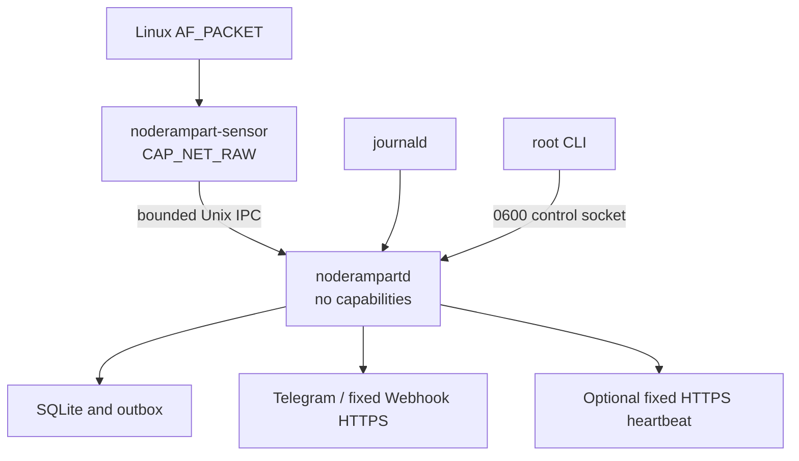

# Architecture

## Trust boundaries

```mermaid
flowchart TD
    K["Linux AF_PACKET"] --> S["noderampart-sensor<br/>CAP_NET_RAW"]
    S -->|"bounded Unix IPC"| D["noderampartd<br/>no capabilities"]
    J["journald"] --> D
    D --> Q["SQLite and outbox"]
    D --> T["Telegram / fixed Webhook HTTPS"]
    D --> H["Optional fixed HTTPS heartbeat"]
    C["root CLI"] -->|"0600 control socket"| D
```

`noderampart-sensor` is the only process with a Linux capability. It opens an AF_PACKET socket, parses only Ethernet/IP/TCP/UDP/ICMP headers, aggregates flow metadata for a configured interval, and sends the aggregate to the daemon. Its detail map is capped by `sensor.max_tracked_flows`; new keys beyond the cap contribute to overflow counters while fixed global inbound SYN/UDP/ICMP and RX/TX counters continue.

`noderampartd` has no Linux capabilities. It validates every sensor frame, enriches remote addresses using local read-only MMDB files, runs detector state machines, writes SQLite, reads OpenSSH messages through a fixed `journalctl` executable, and delivers the persistent notification outbox.

Monitoring/history commands use a mode-`0600` Unix control socket. The daemon verifies `SO_PEERCRED` and accepts only root or its own UID. Explicit asset/catalog update actions in the CLI/TUI can perform bounded HTTPS downloads; ordinary status/history/replay commands do not require Internet access.

## IPC protocol

- Four-byte big-endian length followed by strict JSON.
- Maximum frame size: 1 MiB.
- Maximum flow records per batch: 4,096 by protocol; configuration may select a smaller cap.
- Sensors send version 5, retaining remote ports for UDP request/reply matching
  and allowing real elapsed intervals up to 65 seconds. Version 5 adds per-interface
  session/sequence identity, cumulative collector health and commit acknowledgments.
  New daemons accept versions 1/2/3/4/5; versions 1–3 retain their 60-second interval bound, and
  versions 1–2 have incomplete UDP scan coverage. Older daemons reject version
  5. Upgrade the daemon before the sensor, or stop and replace both.
- Unknown/trailing fields, invalid directions/protocols/IPs, zero or implausible counters, unsafe timestamps, and unsafe interval values are rejected.
- Sensor peers must have the configured sensor service UID, in addition to Unix group permissions. CLI and sensor verify the daemon service UID; control has a 16-connection cap.

JSON is used for the alpha to make captures and compatibility failures inspectable. A bounded binary protocol may replace it after the VM test matrix establishes stable fields.

## Collection and reconciliation

The daemon reads `/proc/net/dev` once per second for authoritative guest-interface totals. The sensor provides per-remote-IP attribution and reads `PACKET_STATISTICS` each batch for kernel packet/drop counts. Reports show these values, statistics-read errors, and the unattributed difference. This is intentionally visible because AF_PACKET loss, cardinality overflow, GRO/GSO/TSO, VPNs, containers, tunnels, and provider metering can make the totals disagree.

Capture parse errors use an atomic counter. If connecting or writing to the
daemon fails, the sensor retains bounded health counters and an estimate of
undelivered batches, packets, and bytes for its next successful write. One shared
250 ms transport deadline covers all writes and dials in a fleet round, so more
interfaces cannot multiply socket blocking time. The listener permits a bounded
burst equal to the configured interface limit, retaining the previous sustained
rate and one-frame decoding bound across reconnects. Failed flow summaries are
discarded instead of being counted in
a later detection-rate window. A saturation flag identifies health totals that
are lower bounds.

The nominal period remains 100 ms–60 seconds. The actual window is not truncated:
it may exceed the nominal period by `max(250ms, period/10)`, capped at 5 seconds.
The daemon checks this configured bound as well as the protocol maximum and
monotonic per-interface timestamps. Longer pauses discard their detail, retain
bounded loss health and close the shared connection to establish a new baseline;
the next valid window contains only new traffic. These discarded windows are
coverage loss, not healthy zero-rate observations.

A successful socket write is not an acknowledgment of daemon persistence.
Version 5 commits collector-health deltas, traffic aggregation and the
session/interface watermark in one transaction, then sends a bounded ACK with a
250 ms write deadline. Derived events and notification decisions are checked
separately; pending/rejected output produces an explicitly partial ACK. An ACK
never confirms external notification delivery. Versions 1–4 and unsequenced
offline batches retain unconfirmed transport semantics.

Collector health is cumulative within an interface session, so an ACK lost after
commit does not repeat health counters on the next batch. Duplicate sequences
do not repeat traffic or detector observations. At most 64 durable watermarks
are retained; retirement is recorded as a coverage limitation and older unknown
sessions are rejected rather than guessed to be new. Sequence/observation gaps
and partial derived output also enter the coverage ledger. Sensor memory holds
at most eight delivery states and no flow spool; there is no historical batch
replay. IPC loss remains an estimate, recovered health enters the recovery
batch's hourly bucket, and sensor restart still limits coverage.

When explicit interface settings are empty, bounded rtnetlink discovery selects
the best main-table IPv4 and IPv6 defaults and deduplicates links. Explicit lists
support eight names; automatic mode budgets two. Flow and capture-buffer limits
are partitioned; scan-port entries share a bounded fleet cap so a legal
per-source threshold remains reachable. Incident and UDP continuity are isolated per interface. Aggregates
sum selected interfaces without claiming packet deduplication across tunnels.

The interface-total collector retries initial route discovery and failed reads
once per second, keeping coverage degraded until it can emit a valid delta.
Selection and interface identity are reconciled each second. Read failures and counter
resets establish a new baseline, so traffic during an observation gap is
omitted instead of being assigned to the recovery interval. Coverage transitions
are retried if their status cannot be stored. Schema 3 retains bounded coverage
intervals, explicit journal gaps and conservative unknown intervals across
process restarts; unrecorded time is not assumed healthy.

## Storage

The configured daemon uses a single exclusive SQLite connection, DELETE rollback journaling, FULL synchronization, disabled cache spills, and a database page ceiling. The ceiling reserves space for the corresponding rollback journal within the active-file budget. See [Storage budget](STORAGE-BUDGET.md) for the exact bound and tradeoffs. Foreign keys, `trusted_schema=OFF`, `secure_delete=FAST`, and a five-second busy timeout remain enabled. The schema contains:

- immutable security events;
- hourly aggregated authentication observations capped at 65,536 keys per hour;
- hourly attributed traffic capped at 16,384 keys per hour;
- hourly authoritative interface totals;
- hourly collector health and loss indicators;
- current component states, bounded coverage intervals/gaps and journal checkpoints;
- persistent notification outbox capped at 10,000 pending messages and 32 MiB of pending bodies;
- idempotent report runs and immutable rendered daily snapshots;
- schema migrations.

The database and parent directory reject relevant symlinks. The database is forced to mode `0600`. Events are retained for seven days and hourly aggregates for thirteen months in the alpha.

Schema 2 adds IPC loss and saturation counters; schema 3 adds recovery, report
history and queue operations. Schema 4 adds event delivery decisions, silences,
coalescing/claim metadata, timeline indexes and per-interface totals.
Transactional upgrades preserve supported historical data and
reject unknown future schemas. Authentication aggregates, generated events,
outbox records and acknowledged journal cursors commit together. A full queue
increments a rejection counter without dropping the stored security event.
Rendered reports are retained for thirteen months and generated with Telegram
both enabled and disabled. Backups use validated VACUUM INTO snapshots.

Incident updates merge only before attempts/claims in a fixed window. The worker
claims and reloads the final body atomically. Silences suppress event admissions
and pending alerts, retain history, and never release a backlog on expiry.
Historical health fills unknown time and separates component, loss and storage
evidence. Backfill uses bounded civil dates and immutable local archives. Offline
JSONL replay uses production detectors with file-local pseudonyms and strict
limits; it never connects to the active daemon or database. Shared contracts and
bounds are detailed in [v0.3 operations](V0.3_OPERATIONS.md).

## Failure behavior

- Sensor absent: daemon continues with SSH monitoring and interface totals; reports state that detailed sensor coverage is unavailable.
- MMDB absent: collection continues with unknown attribution.
- Telegram unavailable: messages remain in the bounded SQLite outbox and retry with exponential backoff and jitter; capacity exhaustion is logged and rejects new queue entries.
- Journal exit restarts with bounded backoff, cursor verification and time/count-limited replay. Collector/storage failures remain visible in independent in-memory health and bounded historical coverage. Control or sensor socket-server exit terminates the daemon for systemd restart.
- Telegram permanent failures are quarantined; ten unsuccessful attempts stop automatic retry. Server waits persist per destination and stop the remainder of a fetched batch. Unsent bodies expire after seven days; sent history remains for thirty days.
- Cardinality cap reached: total counters continue, detail is dropped, and overflow is reported.
- Malformed packet or IPC input: bounded rejection; the process does not execute input as code or shell.

## No active response

The alpha never invokes nftables, iptables, firewalld, Fail2Ban, CrowdSec, or cloud-provider APIs. Detection thresholds can therefore be tuned without a false positive locking the operator out of the VPS.

## Authentication and scan evidence

SSH records require complete message grammar and trusted journal origin metadata;
user-controlled log fragments cannot replace the actual trailing endpoint. Final
OpenSSH Failed records count attempts; PAM and invalid-user messages remain
separate observations. Journal timestamp/checkpoint precision is microseconds.

TCP port scans count SYN initiation evidence. UDP matching uses at most 16,384
recent request tuples for 30 seconds; cold starts, missing fields and collection
loss reduce coverage instead of classifying unknown responses as probes. Scan
source admission prunes expired state first and exposes saturation. Flood
recovery requires consecutive windows without known loss; contributor identity
aggregates all matching flows for a source.

Published alpha.6 schema9 retains bounded complete report documents separately
from notification summaries; schema10 records bounded v5 sensor commit watermarks
and cumulative collector-health baselines; schema11 records event delivery
decisions per Telegram/Webhook channel. Migrations retain historical bodies and
refuse unsupported future schemas. Heartbeat uses no outbox or persistent state;
Webhook shares outbox bounds and immutable target/privacy isolation. Neither
adds a listener. The unreleased alpha.7 timezone/language candidate adds schema12 outbox
presentation fields so retries keep their saved body and coalescing cannot mix
language/timezone contexts; unknown and Local contexts cannot coalesce. Recipient identity and privacy policy are unchanged.

已发布 alpha.6 的 schema9 保存有界完整报告文档、schema10 保存v5采集提交水位和累计
采集健康基线、schema11 按Telegram/Webhook通道记录事件投递决策。迁移保留历史
正文并拒绝未来schema。心跳无持久队列；Webhook复用已有发件队列及目标/隐私隔离。
均不增加监听端口；未发布 alpha.7 时区/推送语言候选新增 schema12 队列呈现字段，重试沿用
已保存正文，合并不混合语言/时区上下文；目标身份及隐私策略不变。

## alpha.8 development candidate: native outbound channels

The fixed notification set is Telegram, generic Webhook, Feishu, WeCom, Discord,
Slack, Teams Workflows and Google Chat, with one target per channel. Six new
channels default disabled. Each uses the existing persistent outbox and leased
worker; the shared event transaction records admission and per-target decisions
before advancing the sensor committed watermark. No network runs under that
transaction or a monitoring lock. Daily reports share the existing timezone and
schedule; native target activation timestamps prevent automatic historical sends.

Native senders hold inspected credential snapshots and derive opaque identities
from channel, canonical endpoint, signing material and file generation. Managed
rotation writes a new owned file and isolates older unsent work. Configuration
is reference-only, schema 1; database schema 13 transactionally expands the event
channel constraint and records native activation. Old schema-12 data, bodies and
presentation metadata survive. New bodies are bounded semantic summaries,
persisted with language/timezone context. Generic Webhook JSON stays unchanged.

Direct native HTTPS uses exact vendor contracts, DNS/connected-address checks,
verified TLS, no proxy or redirects, bounded requests/responses and cancellation.
A fixed worker per enabled channel reserves durable attempt pacing before each
request; only defined acknowledgments count, with Teams displayed as accepted.
See [channel contracts](NOTIFICATION_CHANNELS.md) and [acceptance](ALPHA8_ACCEPTANCE.md).

中文版：八个固定渠道复用持久 outbox/租约/发送前校验，六个新渠道默认停用；
每渠道一个目标与独立去重、队列预算和结果，不增加监听端口或 sensor 权限。
新日报目标保存启用边界，不补发历史。schema 13 保留旧数据/正文/语言时区，
配置 API 1、sensor 协议 5 不变。凭据仅引用，sender 固定快照；轮换隔离旧正文。
